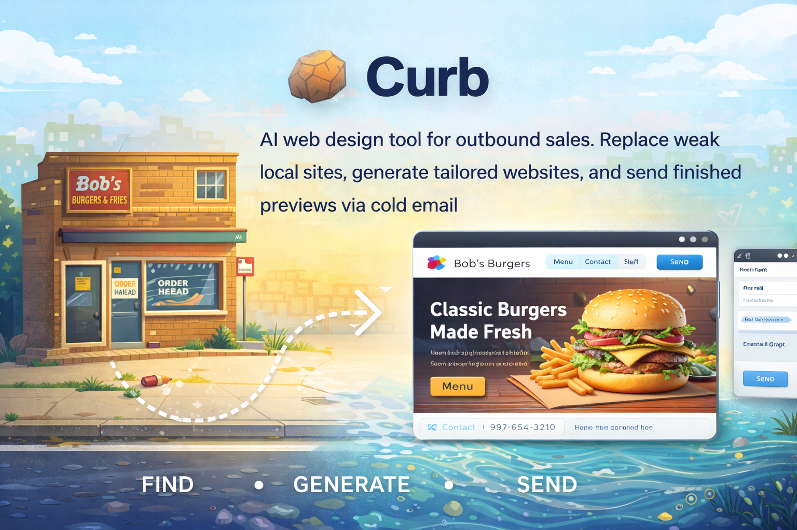
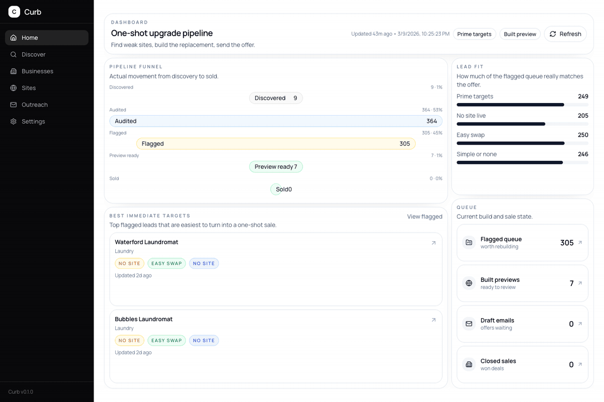

<p align="center">
  
</p>

<p align="center"><strong>Cold outreach with receipts.</strong></p>

<p align="center">Discover weak local-business sites, rebuild them locally, and send the finished preview in the first email.</p>

Curb is a local-first, one-shot website generator for local businesses.

It helps you find a nearby business with no site or a weak one, generate a replacement, preview it locally, and make your first sales contact by emailing them the finished website.

Most web design outreach sells possibility.

Curb sells proof.

## Product Tour

<p align="center">
  
</p>

## The Pitch

Instead of sending:

> "Hey, I could redesign your website."

Curb lets you send:

> "Hey, I already rebuilt it. Here it is."

That changes the conversation. The cold email is no longer a pitch for hypothetical work. It is a reveal.

This is not another generic AI site builder. It is an outbound engine for selling websites to local businesses by building first and asking second.

## What Curb Does

- Discovers local businesses through Google Places
- Enriches business records with contact and location data
- Audits an existing website with screenshots and AI review
- Flags weak, outdated, or missing sites
- Generates a tailored static replacement site
- Previews generated sites inside the local app
- Drafts outreach emails with a preview link and pricing
- Exports handoff-ready site files
- Recommends provider-backed post-sale packs such as Storyblok, Shopify, Square Appointments, and Memberstack when the business needs them
- Tracks the full pipeline in SQLite

## Why It Feels Different

- Local-first. Leads, settings, drafts, screenshots, and generated sites live on your machine.
- One-shot by design. The first touch is the completed website, not a discovery call.
- Static output. The deliverable is a real site, not a mockup.
- Provider-backed handoff. Post-sale admin, store, booking, and member workflows should live in real external products, not a fake `/admin/` inside the generated bundle.
- Human-in-the-loop. You review the audit, the site, and the email before anything gets sent.
- Model-agnostic. Use Anthropic, OpenAI, Google, or OpenRouter.
- Built for operators. This is closer to a sales system for freelancers and agencies than a generic website builder.

## How It Works

1. Discover local businesses by location and category.
2. Audit their current web presence.
3. Flag the ones that are easy to replace.
4. Generate a tailored site into `sites/<slug>/`.
5. Preview it from the local app.
6. Draft the outreach email with the preview URL.
7. Approve, send, and export if they bite.

## What "Local-First" Means Here

- `curb.db` stores the pipeline data.
- `sites/` stores generated websites.
- `site-backups/` stores automatic edit backups for generated sites.
- `.curb-runtime/` stores launcher and runtime state.
- `app/` contains the local dashboard and API routes.
- No auth is required just to use the product.

Local runtime data and customer artifacts stay on your machine and should stay out of git.

The default preview base URL is local. If you want prospects to open the site from your outreach email, set a public `Preview Base URL` in Settings before sending anything.

## Quick Start

### Requirements

- Node.js 20+
- Google Places API key
- One AI provider credential: Anthropic, OpenAI, Google, or OpenRouter

### Docker Launch

Curb and the vendored Agentic OS service can run together with Docker Compose. Curb is exposed on port 3000; Agentic OS stays on the private Compose network and is authenticated with a shared service token.

```bash
cp .env.example .env
# Replace AGENTIC_OS_API_TOKEN with a long random value.
# Example: openssl rand -hex 32

docker compose up --build
```

Open [http://localhost:3000](http://localhost:3000). Agentic OS is reachable by Curb at `http://agentic-os:8080` and is not published directly to the host.

The first Docker version keeps Curb as the authority for business data, generated sites, previews, deployments, email, and payments. Agentic OS receives authenticated task and chat requests and stores its own brain, skills, audit, and task data in separate named volumes. See [`docs/agentic-os-integration.md`](docs/agentic-os-integration.md) for the workspace and security contract.

OpenCode can be included when its package is available:

```bash
INSTALL_OPENCODE=true docker compose build agentic-os
```

### Launch

Recommended:

- macOS: `./launch-curb.command`
- Linux: `./launch-curb.sh`
- Windows: `launch-curb.bat`

The one-click launchers run a production build on first launch, then reuse that build on later launches until app code or config changes.

Manual development:

```bash
cd app
npm install
npm run dev
```

Then open [http://localhost:3000](http://localhost:3000).

## First Run

1. Open `Settings`.
2. Add your Google Places key.
3. Connect an AI provider or paste an API key.
4. Set a reachable `Preview Base URL` if prospects need to view the site.
5. Add your outreach name, business name, address, and email.
6. Add pricing text for outreach drafts.
7. Run `Discover`, then `Audit`, then `Generate`, then `Outreach`.

## Repo Shape

```text
curb/
├── app/               # Next.js dashboard and local API routes
├── sites/             # generated static sites (local, gitignored)
├── site-backups/      # automatic edit backups (local, gitignored)
├── prompts/           # AI prompt templates
├── scripts/           # launcher scripts
├── curb.db            # SQLite database (local, gitignored)
└── .curb-runtime/     # launcher/runtime state
```

## Stack

- Next.js 16
- React 19
- TypeScript
- SQLite via `better-sqlite3`
- Playwright for screenshots and audits
- AI SDK with Anthropic, OpenAI, Google, and OpenRouter support

## Who It's For

Curb is for people who sell websites to local businesses and want a tighter loop than:

1. Cold email
2. Discovery call
3. Proposal
4. Maybe build

If you believe the fastest close is showing the work before the meeting exists, Curb is built for that.

## Status

Curb is opinionated, local-first, and optimized for one-shot website sales.

It is not trying to be a collaborative SaaS CMS or a custom backend generator.

The default architecture is:

- Public site: static files, cheap to host
- Preview and deployment control plane: Curb
- Post-sale content/store/booking/member workflows: real provider back offices chosen per business

It is trying to make outbound feel like a before-and-after reveal.

## One-Line Version

Curb is outbound web design run backwards: build first, email second.
